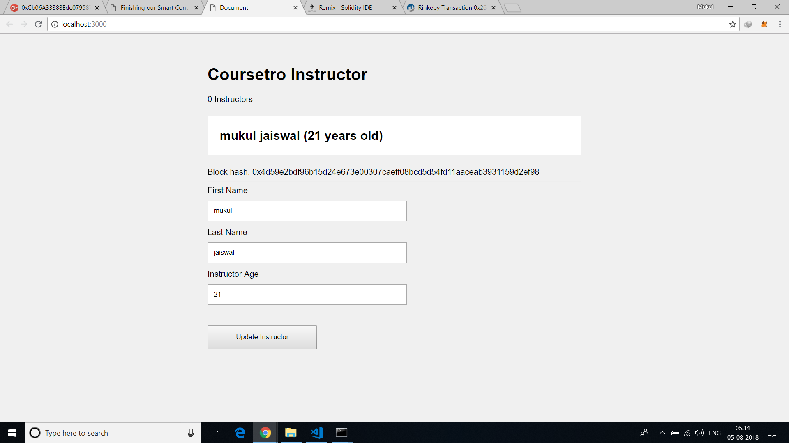

# Etherium-Smart-Contract
Ethereum-testrpc along with the Web3.js Ethereum API to create a web-based UI for interacting with the smart contract.

## For installing lite-server :

```
npm install lite-server --save-dev
```
 
## For accessing localhost:3000
```
npm run dev 
```

## For getting Etherium accounts:
```
testrpc
```

We have to install MetaMask chrome plugin, which will allow us to connect to the Ropsten test network to more accurately simulate the experience of the dApp on the live Ethereum blockchain. Because of this, we have to install a lite-server in order for MetaMask to inject an instance of the Web3 API. If we don't, MetaMask will not work by just loading our index.html file into the browser straight from the hard drive.

## Environment for Remix IDE should be set to :

```
Injeted Web3
```
## GUI


## Transaction Detail


## Ether Amount Detail

I have added 3 ether from RinkeBy Test Network.After First Transaction,it get reduced to 2.999 ether.


## License

This project is licensed under the Apache License 2.0  - see the [LICENSE.md](LICENSE.md) file for details

## Author

* **Mukul Jaiswal** -
